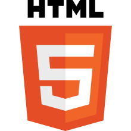
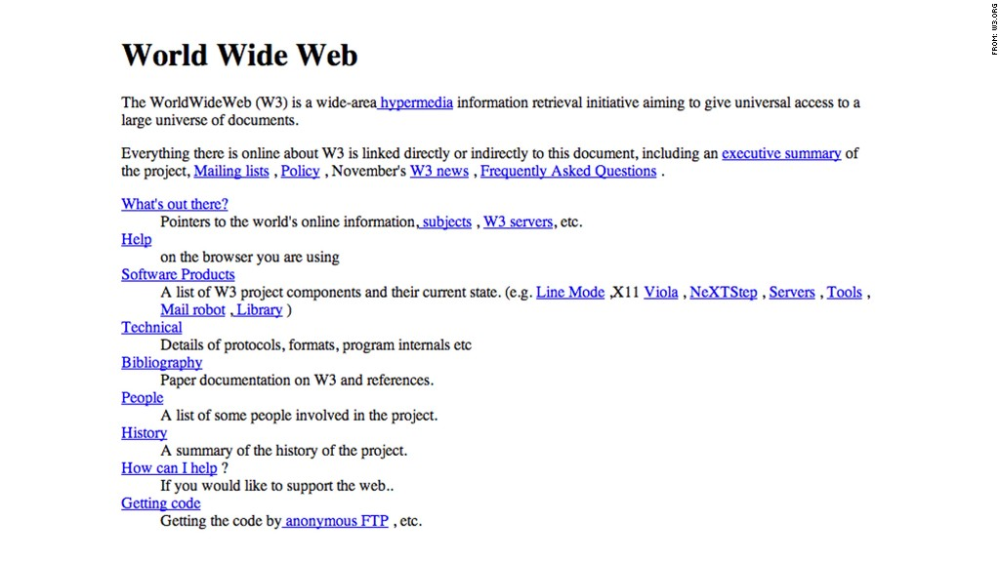
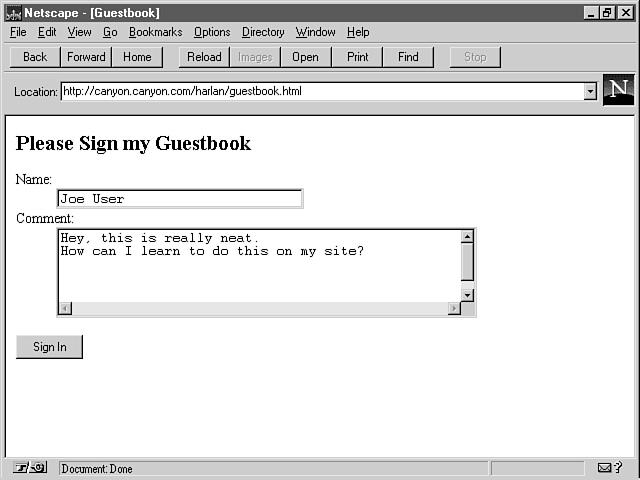
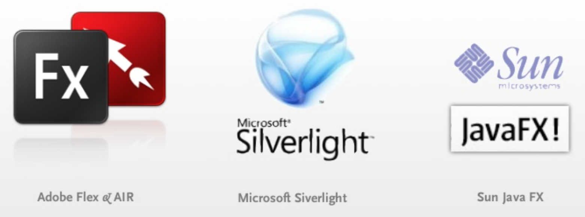
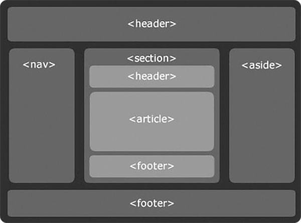
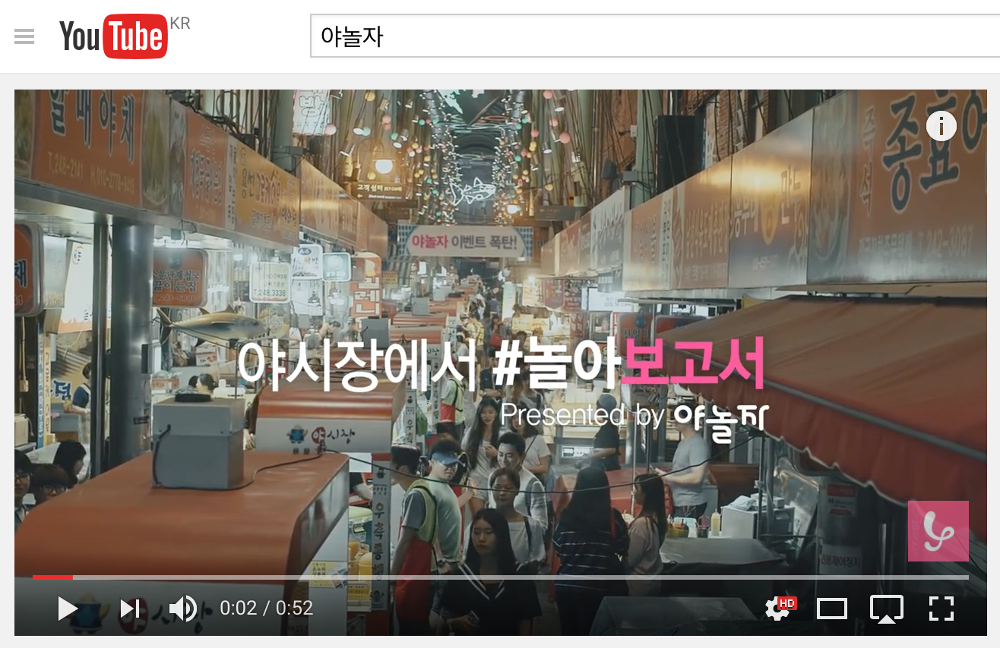
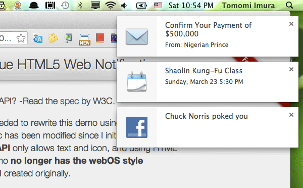
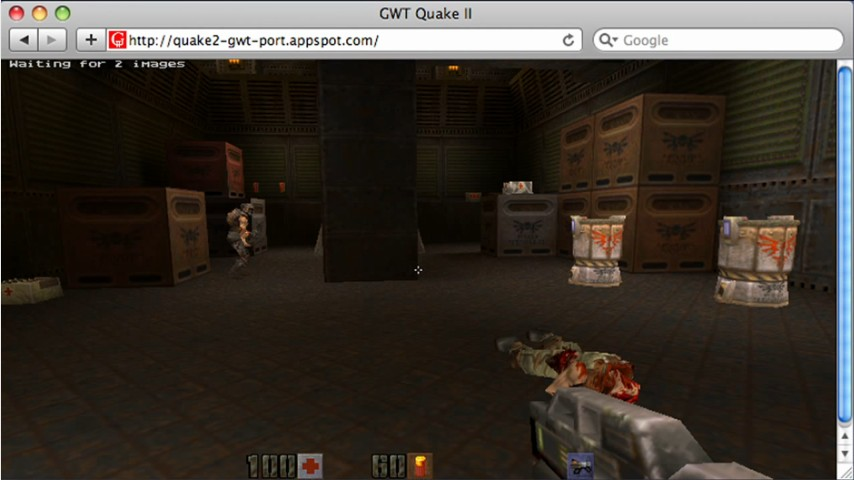

<!-- $theme: gaia -->

# 

---

## HTML

- HyperText Markup Language
- HyperText
  - 인터넷에 올라와 있는 문서를 서로 연결하기 위한 목적을 가진 문서
- HTML
  - HyperText를 표현/구현하기 위한 언어
- &lt;a href="https://www.w3.org"&gt;W3C&lt;/a&gt;

---

## HTML의 역사

- 팀 버너스리가 창설한 W3C에서 웹 표준을 제정
- 강제성은 없음

버전 | 권고 연도
---|---
HTML1 | 1991년 10월
HTML2 | 1995년 11월
HTML3 | 1997년 1월
HTML4 | 1997년 12월
HTML5 | 2014년 10월

---

#### 1. 정보성 문서를 표현 및 웹페이지간의 연결

###### http://info.cern.ch/hypertext/WWW/TheProject.html




---

#### 2. CGI를 통한 인터렉티브 웹

사용자가 취한 행동을 서버로 보내어 동적인 정보를 전송



---

#### 3. JavaScript를 이용한 동적인 페이지 작성

- 화면 전환 없이 페이지 내의 요소들을 변환
- 알림 메시지 등 간단한 인터렉션 구현

---

#### 4. Java/Flash를 통한 Rich Internet Application

플러그인을 통해 화려한 애니메이션을 보여주거나
복잡한 기능을 처리 할 수 있도록 함



---

#### 5. Ajax & DHTML

- 1999년 IE5에서 소개된 XMLHttpRequest를 이용해 플러그인을 이용하지 않고도 페이지 전환 없이 서버와 통신이 가능
- 2000년대 초반부터 Ajax라는 형태로 급속도로 확장됨 (Asynchronous JavaScript and XML)
- 고도화된 JavaScript 기술과 CSS3를 통해 Flash 등의 플러그인을 통하지 않고도 화려한 인터렉션 구현
- 애플이 Flash 지원을 종료하면서 가속화됨

---

#### 6. HTML5 표준 제정

- 완전히 프로그래머블한 XHTML을 표준으로 제정하려고 했지만 하위 호환성 및 사용성이 어려워 무산됨
- 문서의 구조화에 집중하고, 각 브라우저 벤더가 사용하고 있던 기술들을 통합하여 HTML5 제정
- 특히 웹 표준만으로도 완전한 애플리케이션을 만들 수 있도록 멀티미디어와 기기를 제어 할 수 있는 API들을 추가

---

#### 7. 현재

- 웹앱이 대세가 될 것으로 생각했으나 웹브라우저의 성능과 API의 부족으로 대세가 되지는 못함
- 특히 스마트폰이 급격히 배급되면서 모바일에서의 사용성 및 기기제어 문제로 네이티브앱을 더 선호함 
- 웹브라우저의 성능이 향상되고, API 가 지속적으로 추가됨으로 인해서 웹앱이 점차 다시 확장되는 추세
- 네이티브앱에 일부 기능을 웹앱으로 만든 하이브리드앱으로 많이 사용됨

---

## 웹페이지를 구성하는 기술

1. HTML
2. CSS
3. JavaScript (DOM)

---

#### 1. HTML

문서의 구조를 구성

```html
<!doctype html>
<html>
  <head>
	<meta charset="utf-8">
	<title>My title</title>
  </head>
  <body>
    <h1>A heading</h1>
    <a href="http://link.com">Link text</a>
  </body>
</html>
```

---

#### 1-1. HTML Tag

기본 형태

```html
<tag attr1="value1" attri2="value2">보이는 내용</tag>
```

링크 걸기 예제

```html
<a href="http://example.org"
	class="className"
	style="color:#000">

  
</a>
```

---

#### 2. CSS

마크업 언어가 실제 표시되는 방법을 기술하는 언어로, HTML과 XHTML에 주로 쓰임. W3C 표준.

1. 1996년 CSS1 제정
2. 1998년 CSS2 권고안 발표
3. 2011년 CSS 2.1 권고
    - CSS2를 정리/수정 한 것으로, CSS3를 염두에 두고 설계를 변경한 버전
3. 2005년 이후 CSS3 개정 중
    - 편리한 레이아웃 구성 및 다양한 효과와 애니메이션 등, 요소별로 모듈화되어 모듈 단위로 지속적으로 개정 중

---

#### 2-1. CSS block

```css
h1 {
    color: red;
}
```

- h1 : 선택자 (selector)
- color : 속성명
- red : 속성값

---

#### 2-2. CSS selector

```html
<h1 class="title" id="title1">제목 1</h1>
<h1 class="title" id="title2">제목 2</h1>
```

- id : 해당 문서 안에서 같은 이름은 하나만 사용 가능
- class : 하나의 이름을 여러개의 요소에 중복 적용 가능

---

#### 2-3. CSS example

```html
<h1 class="title" id="title1">제목 1</h1>
<h1 class="title" id="title2">제목 2</h1>
```

```css
h1 {
    color: red;
}

.title {
    background: yellow;
    font-weight: bold;
}

#title2 {
    color: blue;
    background: white;
}
```

---

#### 3. JavaScript

- 1995년 넷스케이프와 썬에서 개발
- 1996년 ECMAScript라는 이름으로 표준화 시작
- 1997년 표준화 작업 완료
- 1999년 ECMAScript 3 제정
- 2009년 ECMAScript 5 제정
- 2015년 ECMAScript 6 제정 (ECMAScript 2015)

---

#### 3-1. DOM

- DOM(Document Object Model)은 HTML 및 XML 문서를 처리하는 API
- 문서의 구조를 다루는 기술로써 JavaScript와 같은 언어를 사용하여 문서 내용과 표현을 수정할 수 있도록 함

```html
<!doctype html>
<html>
  <head>
    <title>My title</title>
  </head>
  <body>
    <h1>A heading</h1>
    <a href="http://link.com">Link text</a>
  </body>
</html>
```

---

#### 3-2. DOM


---

#### 3-3. JavaScript Example

```javascript
<!doctype html>
<html>
  <head>
    <title>My title</title>
    <script>
        var header = document.getElementById('header');

        alert(header.value);
    </script>
  </head>
  <body>
    <h1 id="header">A heading</h1>
    <a href="http://link.com">Link text</a>
  </body>
</html>
```

---

#### 3-3. JavaScript Example #2

```javascript
<!doctype html>
<html>
  <head>
    <title>My title</title>
  </head>
  <body>
    <h1 id="header">A heading</h1>
    <a href="http://link.com">Link text</a>

    <script>
        var header = document.getElementById('header');

        alert(header.value);
    </script>
  </body>
</html>
```

---

#### 3-3. JavaScript Example #3

```javascript
<!doctype html>
<html>
  <head>
    <title>My title</title>
    <script>
      document.addEventListener("DOMContentLoaded",
        function() {
          var header = document.getElementById('header');
          alert(header.value);
      }); 
    </script>
  </head>
  <body>
    <h1 id="header">A heading</h1>
    <a href="http://link.com">Link text</a>
  </body>
</html>
```


---

## HTML5

- 문서의 구조화
  - header, nav, article, section, aside, footer
- 멀티미디어
  - video, audio, canvas
- API
  - 서버와의 직접적인 양방향 통신
  - 오프라인 사용
  - 기기제어

---

#### 1. Semantic Tags

```html
<section>
  <header>
    <h1>메인 섹션</h1>
  </header>

  <article>
    <h1>제목</h1>
    <p>본문의 내용은 여기에</p>
  </article>

  <footer>
    <p>섹션 하단</p>
  </footer>
</section>

<aside>
  <p>광고 영역</p>
</aside>
```

---

#### 1-1. Semantic Tags



---

#### 2. Multimedia



---

#### 3. APIs

- Application Cache
- Web Storage
- Web Sockets
- Drag and Drop
- Geolocation
- Notifications
- File API
- WebGL

----

#### 3-1. Application Cache

CSS, 이미지, 자바스크립트 등과 같은 리소스를 로컬 장비에 다운 받아둘 수 있게 해 주는 API

- 오프라인 상태에서도 사용자가 사이트를 이용할 수 있게 함
- 로컬 장비에 저장된 리소스는 빠른 속도로 불러들일 수 있으므로, 사용성을 높일 수 있음
- 리소스가 변경된 경우에만 다운로드를 시도하므로 트래픽 사용량을 줄일 수 있음

----

#### 3-2. Web Storage

- Web Storage는 일종의 클라이언트-사이드 데이터베이스로써, 서버가 아닌 각 사용자의 브라우저에 보관됨
- key-value 형식으로 사용할 수 있으며 단순한 데이터를 저장하기에 적합함
- 복잡한 형식의 데이터는 IndexedDB API를 이용하여 쿼리 기반의 데이터베이스를 사용할 수 있음

----

#### 3-3. Web Sockets

- 웹 애플리케이션이 서버와 브라우저 사이의 실시간 양방향 통신 채널을 제공
- WebSocket은 가볍게 구성되어 있어 XHR보다 대역폭 소비가 적어, 보다 빠른 통신을 가능케 함
- 서버에서 Web Sockets 프로토콜을 지원해야 함

----

#### 3-4. Drag & Drop

- 기존에도 "mousemove", "mousedown", "mouseup" 등의 이벤트를 이용하여 Drag & Drop을 구현할 수 있었지만,다양한 예외상황을 직접 처리해줘야해서 부하나 오작동이 많았음
- HTML5에서 함께 지원하고 있는 File API와 함께 사용하여 데스크탑에 준하는 환경을 쉽게 구현할 수 있게 됨

----

#### 3-5. Geolocation

- 사용자의 위치 정보를 받아올 수 있음
- 단, 사용자의 승인이 필요함
- HTTPS에서만 사용 가능
  - HTTP over TLS/SSL

----

#### 3-6. Notifications

- 브라우저 내부가 아닌 OS단에서 특정 이벤트에 대한 알림을 표시해 줄 수 있도록 함



----

#### 3-7. File API

- 웹 애플리케이션이 로컬 파일에 접근할 수 있게 함
- 사용자가 선택한 파일에 접근하여 파일의 이름, 경로, 크기 등의 정보는 물론, 이미지의 EXIF 등에 대한 정보를 가져올 수 있음
- canvas 요소등을 응용하여 파일을 서버에 업로드하지 않고도 포멧을 변환하거나, 변환한 후 서버로 업로드 하는 등의 기능 구현이 가능
- 사용자가 직접 선택한 파일만 접근 할 수 있으며 읽기만 가능
- FileSystem API를 사용하면 로컬 영역에 파일을 쓸 수 있으나, 샌드박스 안에서만 가능

----

#### 3-8. WebGL

- 웹브라우저 상에서 플러그인을 사용하지 않고 3D 그래픽을 구현할 수 있도록 해 주는 API
- OepnGL의 JavaScript 바인딩
- 하드웨어 가속을 지원하여 실시간 렌더링이 가능

---

#### 4. Example

http://www.quakejs.com



---

#### 5. Web Apps

- Google Maps
- Google Apps (Docs, Spreadsheets...)
- Apple iCloud
- Netflix
- Facebook
- ...
- Chrome Web Store

---

실습
===

---

개발 환경 구축
===

---

HTML 기본 구조 구성
===

---

CSS3로 디자인 입히기
===

---

Drag & Drop
===

---

Geolocation + 구글 지도
===

---

D3.js
===

---

&lt;/end&gt;
===